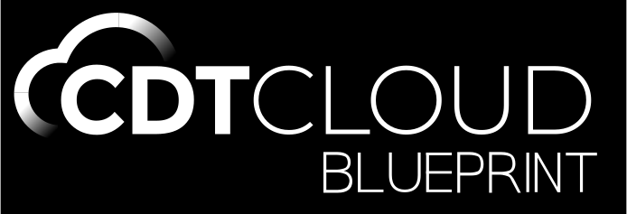

<br/>
<div id="cdt-cloud-logo" align="center">
    <br />
    
    <h3>CDT Cloud Blueprint</h3>
</div>

<div id="badges" align="center">

CDT Cloud Blueprint is a template for building custom web-based C/C++ tools. It is made up of existing open source components and can be easily downloaded and installed on all major operating system platforms.

</div>

[Visit the CDT Cloud website for more information](https://www.eclipse.org/cdt-cloud/).

## License

- [Eclipse Public License 2.0](LICENSE)
- [一 (Secondary) GNU General Public License, version 2 with the GNU Classpath Exception](LICENSE)

## What is this?

CDT Cloud Blueprint is a template for building custom web-based C/C++ tools. It is made up of existing open source components and can be easily downloaded and installed on all major operating system platforms.

CDT Cloud Blueprint also serves as a **template** for building desktop-based products based on the Eclipse Theia platform, as well as to showcase Eclipse Theia capabilities combined with C/C++ tools. It is made up of a subset of existing Eclipse Theia features and extensions. [Documentation is available](https://theia-ide.org/docs/composing_applications/) to help you customize and build your own web-based C/C++ product based on Eclipse Theia.

## What is it not?

CDT Cloud Blueprint is ***not*** **a production-ready product**. Therefore, it is also not meant to be a replacement for Visual Studio Code or any other IDE.

## Current state

CDT Cloud Blueprint is in an early alpha state and undergoing active development.
See [this milestone for release 1.0](https://github.com/eclipse-cdt-cloud/cdt-cloud-blueprint/milestone/1).

## Development

CDT Cloud Blueprint is based on [Eclipse Theia Blueprint](https://github.com/eclipse-theia/theia-blueprint).

### Requirements

Please check Theia's [prerequisites](https://github.com/eclipse-theia/theia/blob/master/doc/Developing.md#prerequisites), and keep node versions aligned between CDT Cloud Blueprint and that of the referenced Theia version.

### Documentation

Documentation on how to package Theia as a Desktop Product may be found [here](https://theia-ide.org/docs/blueprint_documentation/)

### Repository Structure

- Root level configures mono-repo build with lerna
- `applications` groups the different app targets
  - `browser` contains a browser based version of Eclipse Theia Blueprint that may be packaged as a Docker image
  - `electron` contains the Electron app to package, packaging configuration, and E2E tests for the Electron target.
- `theia-extensions` groups the various custom theia extensions for Blueprint
  - `product` contains a Theia extension contributing the product branding (about dialogue and welcome page).
  - `updater` contains a Theia extension contributing the update mechanism and corresponding UI elements (based on the Electron updater).
  - `launcher` contains a Theia extension contributing, for AppImage applications, the option to create a script that allows to start blueprint from the command line by calling the 'theia' command.

### Build

This repository contains three application variants: browser, Docker and Electron.
Below are instructions for building each variant.

#### Preparing the workspace

First, download the necessary dependencies, VS Code extensions, and tracecompass-server.
This step is not necessary when building the [Docker image](#docker-application).

```sh
yarn setup
```

The `setup` script runs these scripts, which can also be executed individually:

```sh
yarn
yarn build:extensions
yarn download:plugins
yarn tracecompass-server:download
```

Note: Downloading plugins and tracecompass-server is optional but recommended for full functionality.

In the [Docker-based development](#docker-based-development) environment, this step is automated.

#### Electron application

The Electron application is the main product of CDT Cloud Blueprint.

##### Build Electron application

```sh
yarn electron build
```

##### Start Electron application

```sh
yarn electron start
```

##### Package Electron application

Packaging the Electron application produces an installer or standalone executable for the current platform.

```sh
yarn package:applications
# or (if the trace-compass server was already downloaded)
yarn electron package
```

The packaged application is located in `applications/electron/dist`.

##### Create a preview Electron application

Generate a preview of the Electron application directory without packaging, useful for directory layout debugging.

```sh
yarn package:applications:preview
# or (if the trace-compass server was already downloaded)
yarn electron package:preview
```

Locate the preview in `applications/electron/dist`.

#### Browser application

A variant of CDT Cloud Blueprint that runs in the browser.

##### Build browser application

```sh
yarn browser build
```

##### Start browser application

```sh
yarn browser start
```

The application will be available at <http://localhost:3000/>

#### Docker application

The browser variant of the application packaged in a reproducible environment with all the required dependencies and tools.
Ideal for testing the application without setting up any prerequisites or for cloud use cases.

##### Build Docker image

```sh
docker build -t cdt-cloud-blueprint:latest .
```

##### Start Docker image

```sh
docker run -it -p 0.0.0.0:3000:3000 cdt-cloud-blueprint:latest
```

The application will be available at <http://localhost:3000/>

#### Build all applications

Transpile the sources and build all three applications (browser, Docker and Electron) with one script.
Useful for preparing all three variants for testing.
Note that the build process may be time-consuming.

For development and casual testing of Blueprint, build CDT Cloud Blueprint in "dev" mode.
This permits building Blueprint on systems with less resources, like a Raspberry Pi.
Note that minification is turned off then.

```sh
yarn build:dev
```

For production Blueprint applications use:

```sh
yarn build
```

### Docker-based development

1. Install the [Remote Dev extension pack](https://marketplace.visualstudio.com/items?itemName=ms-vscode-remote.vscode-remote-extensionpack) in VS Code
2. Open this repository in VS Code
3. Confirm to open this folder in the remote container when prompted.
4. Once VS Code is opened in the container and the `Configuring Dev Container` task is finished, run `yarn browser start` in the container's terminal to start the CDT Cloud Blueprint backend.
5. Access CDT Cloud Blueprint at 127.0.0.1:3000 from the host.

Make changes to the source code and rebuild with `yarn build:extensions && yarn browser build` or run `yarn watch` beforehand.
After a browser refresh, the changes should take effect.

### Running E2E Tests

The E2E tests basic UI tests of the actual application.
This is done based on the preview of the packaged application.

```sh
yarn electron package:preview
yarn electron test
```

### Workspace and example files

- To use the trace view, download and start the [TraceCompassServer](https://download.eclipse.org/tracecompass.incubator/trace-server/rcp/)
- Example traces can be found here: [TraceCompassTutorialTraces](https://github.com/tuxology/tracevizlab/blob/master/labs/TraceCompassTutorialTraces.tgz)
- An example workspace including a trace can be found [here](https://github.com/eclipsesource/cdtcloud-alpha/tree/master/example/workspace)
- Clangd contexts also provides an example workspace, see [here](https://github.com/eclipse-cdt-cloud/clangd-contexts/tree/main/examples/clangd-workspace).

### Troubleshooting

- [_"Don't expect that you can build app for all platforms on one platform."_](https://www.electron.build/multi-platform-build)

### Reporting Feature Requests and Bugs

The features in CDT Cloud Blueprint are based on Theia and the included extensions/plugins. For bugs in Theia please consider opening an issue in the [Theia project on Github](https://github.com/eclipse-theia/theia/issues/new/choose).
CDT Cloud Blueprint only packages existing functionality into a product and installers for the product. If you believe there is a mistake in packaging, something needs to be added to the packaging or the installers do not work properly, please [open an issue on Github](https://github.com/eclipse-cdt-cloud/cdt-cloud-blueprint/issues/new/choose) to let us know.
