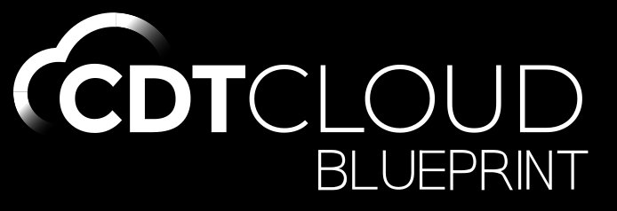

<br/>
<div id="cdt-cloud-logo" align="center">
    <br />
    
    <h3>CDT.cloud Blueprint</h3>
</div>

<div id="badges" align="center">

CDT.cloud Blueprint is a template for building custom web-based C/C++ tools. It is made up of existing open source components and can be easily downloaded and installed on all major operating system platforms.

</div>

[Visit the CDT.cloud website for more information](https://cdt-cloud.io/).

## License

- [Eclipse Public License 2.0](LICENSE)
- [一 (Secondary) GNU General Public License, version 2 with the GNU Classpath Exception](LICENSE)

## What is this?

CDT.cloud Blueprint is a template for building custom web-based C/C++ tools. It is made up of existing open source components and can be easily downloaded and installed on all major operating system platforms.

## What is it not?

CDT.cloud Blueprint is ***not*** **a production-ready product**. Therefore, it is also not meant to be a replacement for Visual Studio Code or any other IDE.

## Current state

CDT.cloud Blueprint is in an early alpha state and undergoing active development.
See [this milestone for release 1.0](https://github.com/eclipse-cdt-cloud/cdt-cloud-blueprint/milestone/1).

## Development

CDT.cloud Blueprint is based on [Eclipse Theia Blueprint](https://github.com/eclipse-theia/theia-blueprint).

### Requirements

Please check Theia's [prerequisites](https://github.com/eclipse-theia/theia/blob/master/doc/Developing.md#prerequisites), and keep node versions aligned between CDT.cloud Blueprint and that of the referenced Theia version.

### Documentation

Documentation on how to package Theia as a Desktop Product may be found [here](https://theia-ide.org/docs/blueprint_documentation/)

### Repository Structure

- Root level configures mono-repo build with lerna
- `applications` groups the different app targets
  - `electron` contains app to package, packaging configuration, and E2E tests for the Electron target.
- `theia-extensions` groups the various custom theia extensions for CDT.cloud Blueprint
  - `theia-blueprint-product` contains a Theia extension contributing the product branding (about dialogue and welcome page).
  - `theia-blueprint-updater` contains a Theia extension contributing the update mechanism and corresponding UI elements (based on the Electron updater).

### Build

```sh
yarn
```

### Package the Application

```sh
yarn electron package
```

The packaged application is located in `applications/electron/dist`.

### Create a Preview Application (without packaging it)

```sh
yarn electron package:preview
```

The packaged application is located in `applications/electron/dist`.

### Workspace and example files

- To use the trace view, download and start the [TraceCompassServer](https://download.eclipse.org/tracecompass.incubator/trace-server/rcp/)
- Example traces can be found here: [TraceCompassTutorialTraces](https://github.com/tuxology/tracevizlab/blob/master/labs/TraceCompassTutorialTraces.tgz)
- An example workspace including a trace can be found [here](https://github.com/eclipsesource/cdtcloud-alpha/tree/master/example/workspace)
- Clangd contexts also provides an example workspace, see [here](https://github.com/eclipse-cdt-cloud/clangd-contexts/tree/main/examples/clangd-workspace).

### Running E2E Tests

The E2E tests basic UI tests of the actual application.
This is done based on the preview of the packaged application.

```sh
yarn electron package:preview
yarn electron test
```

### Docker based development

1. Install the [Remote Dev extension pack](https://marketplace.visualstudio.com/items?itemName=ms-vscode-remote.vscode-remote-extensionpack) in VS Code
2. Open this repository in VS Code
3. In the notification that should appear: confirm to open this folder in the remote container instead
4. Once VS Code is opened in the container, run `yarn browser start` in the container's terminal to start the CDT.cloud blueprint backend.
5. Once, CDT.cloud blueprint is up, it should be running on 127.0.0.1:3000 and can be accessed from the host.

Now you can make changes to the source code and rebuild with `yarn` or run `yarn watch` before the changes. After a browser refresh, your changes should get effective.

### Troubleshooting

- [_"Don't expect that you can build app for all platforms on one platform."_](https://www.electron.build/multi-platform-build)

### Reporting Feature Requests and Bugs

The features in CDT.cloud Blueprint are based on Theia and the included extensions/plugins. For bugs in Theia please consider opening an issue in the [Theia project on Github](https://github.com/eclipse-theia/theia/issues/new/choose).
CDT.cloud Blueprint only packages existing functionality into a product and installers for the product. If you believe there is a mistake in packaging, something needs to be added to the packaging or the installers do not work properly, please [open an issue on Github](https://github.com/eclipse-cdt-cloud/cdt-cloud-blueprint/issues/new/choose) to let us know.
